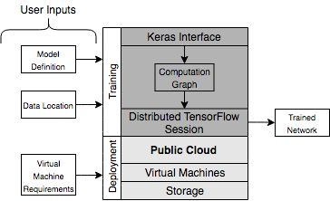
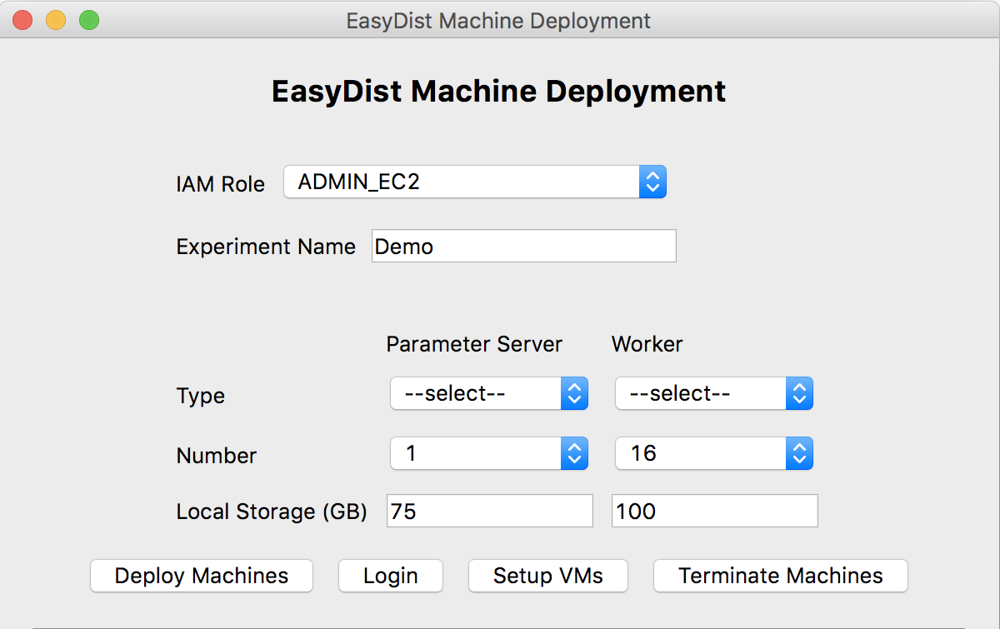

# What is EasyDist ?
> An end-to-end distributed deep learning (multi machine multi gpu) tool that mimics the single-machine keras programming model by leveraging distributed TensorFlow between a Keras interface and public cloud infrastructure (AWS).



Neural network based deep learning models are fuelling the growth of innovative artificial intelligence (AI) applications. However, training a complex model on large scale data requires a significantly long time when a single machine is used for model development. Unfortunately, existing distributed deep learning (DDL) solutions present a **steep learning curve** for first time users. 
* The direct use of frameworks (eg., TensorFlow) for DDL requires significant boilerplate code
* High level abstractions such as Keras do not natively support multi machine training
* Dimensions such as the choice of parallelism, resource deployment, data organisation and run-time control are left up to user discretion.

EasyDist enables multi-machine multi-gpu training without the need for boilerplate code or manual cluster setup. EasyDist includes a UI for resource provisioning and a python API for training. EasyDist was developed with a modular, layered architecture that  brings together the three main DDL dimensions :
* Cluster provisioning through public cloud (AWS)
* Deep learning framework for distributed  training (Distributed TensorFlow)
* A clean interface and easy to use API

EasyDist integrates the parameter server architecture available in Distributed TensorFlow with GPU virtual machines launched through AWS to provided easy access to asynchronous distributed data parallel training.

**Key Features**

* Mimics the single machine Keras programming model
* No boiler plate code
* Model agnostic distributed training
* Seamless cloud integration
* Distributed training via single API call
* In-built data distribution 

# Installation

OS X & Linux:

1. Have [PyQt5](https://pypi.org/project/PyQt5/) installed to be able to use the deployment UI
2. Clone this  repo
3. Run ```python setup.py install``` from the cloned repo

Windows: No support for Windows currently

# Usage 

## Prerequisites

* Your AWS CLI credentials should be configured  (run `aws configure` from the shell if not already done. 
* Your AWS account should have at least one IAM Role with EC2 launch/terminate privileges ( [Create IAM Role](https://docs.aws.amazon.com/IAM/latest/UserGuide/getting-started_create-admin-group.html) )
* Your AWS account should also have the ec2 service limits for the number of instances you wish to deploy [AWS Service Limits](https://docs.aws.amazon.com/AWSEC2/latest/UserGuide/ec2-resource-limits.html)
* Place your training data inside a folder in a bucket on AWS S3 (Please see examples folder to create dummy data and place it in a bucket to run the example code using instructions below)


## Virtual Machine Deployment

1. Initiate the UI by running `python easydistUI.py`

2. Select the required options for the GPU cluster you wish to provision 
3. Click on "Deploy Machines"
4. After the process is complete, click on "Login" to login to the Parameter Server VM (It might take a few minutes before you can login as the deployed machines need to boot)
5. Once you have logged in successfully, Click on "Setup VMs". This will setup easydist and its dependencies on all VMs of the cluster.

## Distributed Training

**This will be executed from the parameter server**
 
 You need to write two files which should be present in the home directory of the parameter server:
* A model definition file that contains the keras network and EasyDist API calls (see examples folder)

```python
from keras.models import Sequential, Model
from keras.layers import Dense, Embedding
from keras.layers import LSTM, Input, Activation, multiply
from keras.preprocessing import sequence
##Sample of Neural Network Architecture #####
max_features = 4000
maxlen = 400 # cut sequences after this number of token 
input1 = Input(shape=(maxlen,))
X1 = Embedding(max_features, 256, dropout=0.1,mask_zero=True)(input1)
X1 = LSTM(64, dropout_W=0.2, dropout_U=0.2)(X1)
X = Dense(32)(X)
X = Dense(1)(X)
y = Activation('sigmoid')(X)  
rnn = Model(input=[input1, input2], output=y)
rnn.compile(loss='binary_crossentropy',optimizer = 'adam') 

#  END of sample of Neural Network Architecture #

# The below code starts training the model using Distributed TensorFlow on the provisioned cluster 
from distExec import ExecutionEnvironment
#bucket should point to the S3 bucket which contains training data
#prefix should point to the folder (prefix) within that bucket which contains the training data
#eg. s3://easydist.data/rnnData/ will contain all training data files
env=ExecutionEnvironment(bucket = 'easydist.data',prefix = 'rnnData/',
                         epochs = 1, batch_size = 32, opt= 'adam')
env.fit() 
```

* A "preprocessing.py" file. This file should have the following :
    * A class named **Preprocessing** which contains a method with the signature **preprocess(self,keys,objects)**
        * **objects** is a list of of file handles to the training files and **keys** is a list with the corresponding filenames
        * This function shuold return the following (inputs, outputs, train_size)
            * **inputs** should contain a list of all inputs to the network
            * **ouputs** should contain a list of labels
            * **train_size** should be an integer corresponding to the number of inputs

```python
# Code:
# User can pre-process the raw data based on various data sets by overriding the following # 
# preprocessing class. User needs to feed in user’s own code in the preprocess method. User should not modify the method definition and return arguments #

import pandas as pd
import numpy as np
import time
import boto3
import io
import os

class Preprocessing:
    def __init__(self):
        print('Start Pre-processing')

    def preprocess(self,keys,objects):
        #Pre Process the data and ensure that the return signature is (inputs,outputs,train_size)        
        print("Processing the Data")
        '''
        Reading a non csv file  can be done as         
        response = objects[0].read()
        Embed your pre-processing code here
        After processing, it returns inputs, outputs and train_size
        '''
        #Reading the Data and concatenating the chunks
        loop = 0
        df = None
        for i in len(objects):
            print('Reading Key: ', keys[i])
            temp = pd.read_csv(io.BytesIO(objects[i].read()), encoding='utf8')
            if loop == 0:
                df = temp
                loop += 1
            else:
                df = pd.concat([df,temp])
        x1 = df['x1'].values
        x1 = [list(map(float,y.split(' ')))for y in x1]

        labels = [int(x) for x in df['y'].values]
        labels = np.array(labels)
        labels = labels.reshape(len(labels),1)

        inputs=[np.array(x1)]
        outputs=[labels]
        train_size = len(x1)

        print('Training Size is ', train_size)
        return (inputs,outputs,train_size)
```
* You can start the training by running `python modelDefinition.py` 
    * This will create a folder called **models** and **experiments**
        * **models** will contain the trained models (network + weights) in .pbtxt format
        * **experiments** will contain the console outputs from each worker machine. These can be used to check the current status of the training.
* Once you are done, and have backed up your files/models you can safely terminate all machines of the cluster by clicking the **Terminate Machines** button on the UI
        

# Executing Tests

* Ensure that you have nosetests installed (pip install nosetests)
* Navigate to the tests folder and run 'nosetests'


# Release History

* 0.1
    * First release

## Meta

Distributed under the Apache 2.0 license. See ``LICENSE`` for more information.

# Contributing
  
  We welcome Your interest in the American Express Open Source Community on Github.
  Any Contributor to any Open Source Project managed by the American Express Open
  Source Community must accept and sign an Agreement indicating agreement to the
  terms below. Except for the rights granted in this Agreement to American Express
  and to recipients of software distributed by American Express, You reserve all
  right, title, and interest, if any, in and to Your Contributions. Please [fill
  out the Agreement](https://cla-assistant.io/americanexpress/easydist).

  # License
  
  Any contributions made under this project will be governed by the [Apache License
  2.0](https://github.com/americanexpress/EasyDist/blob/master/LICENSE.txt).

  # Code of Conduct
  
  This project adheres to the [American Express Community Guidelines](https://github.com/americanexpress/EasyDist/blob/master/CODE_OF_CONDUCT.md).
  By participating, you are expected to honor these guidelines.
